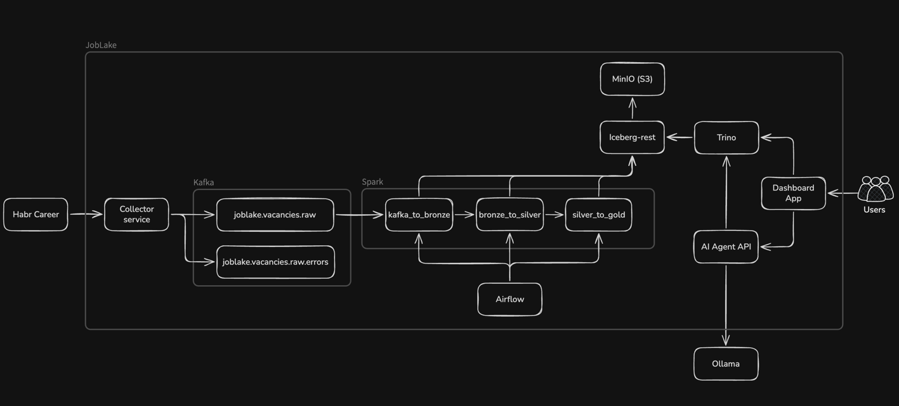

# JobLake

AI-powered lakehouse platform for IT job market analytics.

## Table of Contents

- [Overview](#overview)
- [Screenshots](#screenshots)
- [Architecture](#architecture)
- [Data Sources](#data-sources)
- [Repository Layout](#repository-layout)
- [Quick Start](#quick-start)
- [Services](#services)
- [Lakehouse Tables](#lakehouse-tables)
- [License](#license)

Service documentation:

- [Dashboard app](src/app/README.md)
- [AI agent API](src/agent/README.md)
- [Collector service](src/collector/README.md)

## Overview

The project is built around a local analytical stack:

- Habr Career vacancy ingestion into Kafka.
- Spark jobs that move data from raw Kafka events into Iceberg tables.
- Bronze, Silver, and Gold data layers for raw storage, normalization, and analytics.
- Trino as the SQL query engine for dashboards and agent tools.
- Streamlit dashboard for market metrics, demand trends, salaries, companies, and recent
  vacancies.
- FastAPI AI-agent service backed by Ollama and Trino tool calls.
- Airflow DAG for orchestrating Spark processing steps.

## Screenshots

Dashboard overview:


Dashboard demand and salary analytics:


Recent vacancies and detailed tables:


AI agent chat:


## Architecture



## Data Sources

The current collector implementation ingests vacancies from
[Habr Career](https://career.habr.com/). The data model keeps a `source` field and the
lakehouse tables are source-aware, so the pipeline is designed to support additional job
market sources later.

Use this project responsibly: respect source website terms, robots policies, request-rate
limits, and privacy constraints. The repository stores processing code and local
infrastructure definitions; collected vacancy data is produced by runtime ingestion.

## Repository Layout

```text
.
├── assets/              # README screenshots
├── docker/              # Spark Docker image
├── src/
│   ├── agent/           # FastAPI AI agent service
│   ├── app/             # Streamlit dashboard
│   ├── collector/       # Habr Career ingestion job
│   ├── dags/            # Airflow DAGs
│   └── spark-apps/      # Spark lakehouse jobs
├── trino/catalog/       # Trino catalog configuration
├── docker-compose.yml   # Local infrastructure and services
├── Makefile             # Common compose commands
└── LICENSE
```

## Quick Start

Prerequisites:

- Docker and Docker Compose.
- `make` for shortcut commands.
- Ollama available on the host if you want to use the AI agent chat.

Create local environment configuration:

```bash
cp .env.example .env
```

Start the platform:

```bash
make up
```

Open the main interfaces:

| Component | URL |
| --- | --- |
| Dashboard app | <http://localhost:8501> |
| Agent API | <http://localhost:8088/api/v1/docs> |
| Airflow | <http://localhost:9900> |
| Kafka UI | <http://localhost:9090> |
| MinIO Console | <http://localhost:9001> |
| Spark Master UI | <http://localhost:8000> |
| Trino | <http://localhost:8082> |

Default local credentials are defined in `.env.example`.

## Services

| Service | Purpose | Documentation |
| --- | --- | --- |
| `collector` | Crawls Habr Career vacancies and publishes raw records to Kafka. | [src/collector](src/collector/README.md) |
| `agent` | FastAPI service with Ollama tool-calling over Trino analytics tables. | [src/agent](src/agent/README.md) |
| `app` | Streamlit dashboard and chat UI for the AI agent. | [src/app](src/app/README.md) |
| `airflow-*` | Orchestrates the lakehouse processing DAG. | [DAG source](src/dags/daily_joblake_pipeline.py) |
| `spark-*` | Executes Bronze, Silver, and Gold processing jobs. | [Spark apps](src/spark-apps) |
| `trino` | SQL access to Iceberg Gold tables. | [Catalog config](trino/catalog/joblake.properties) |
| `minio`, `iceberg-rest` | Local S3-compatible storage and Iceberg catalog. | [Compose file](docker-compose.yml) |

## Lakehouse Tables

Bronze:

- `joblake.bronze.vacancies_raw` - raw Kafka events with payload, key, headers, offsets, and
  ingestion timestamp.

Silver:

- `joblake.silver.vacancies`
- `joblake.silver.companies`
- `joblake.silver.skills`
- `joblake.silver.vacancy_skills`
- `joblake.silver.specializations`
- `joblake.silver.vacancy_specializations`
- `joblake.silver.locations`
- `joblake.silver.vacancy_locations`
- `joblake.silver.rejected_vacancies`

Gold:

- `joblake.gold.vacancies_enriched`
- `joblake.gold.vacancy_overview_daily`
- `joblake.gold.skill_demand`
- `joblake.gold.specialization_demand`
- `joblake.gold.location_demand`
- `joblake.gold.company_demand`
- `joblake.gold.salary_distribution`


## License

This project is licensed under the MIT License. See [LICENSE](LICENSE) for details.
