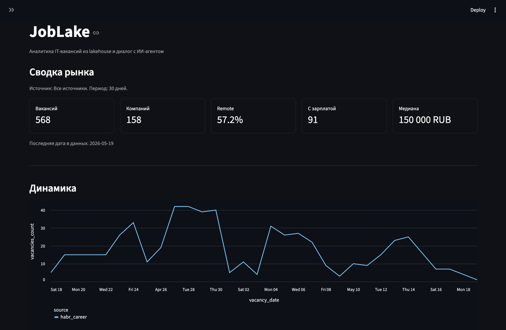
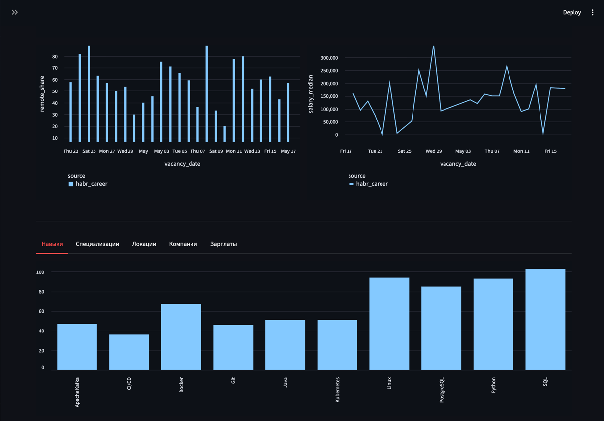
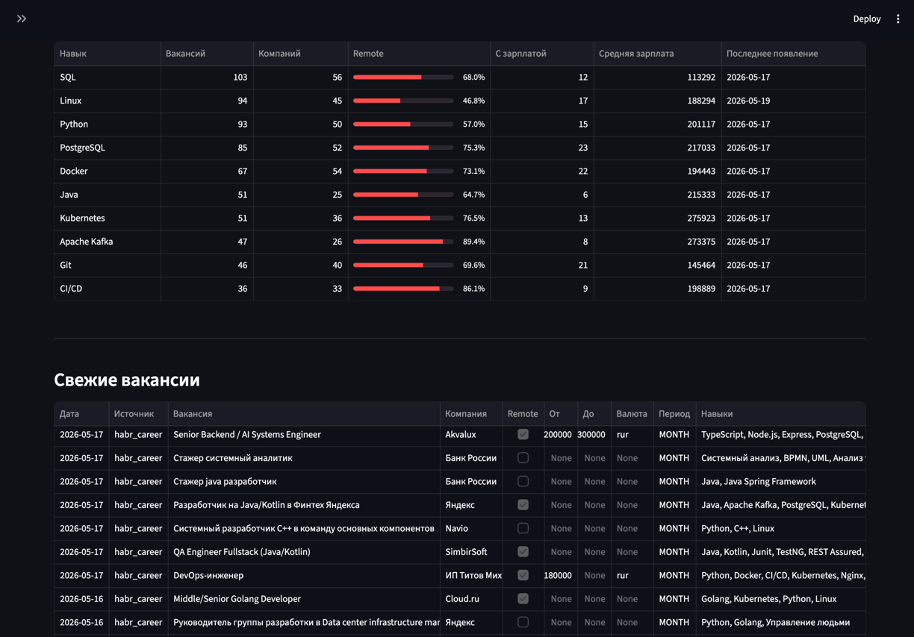
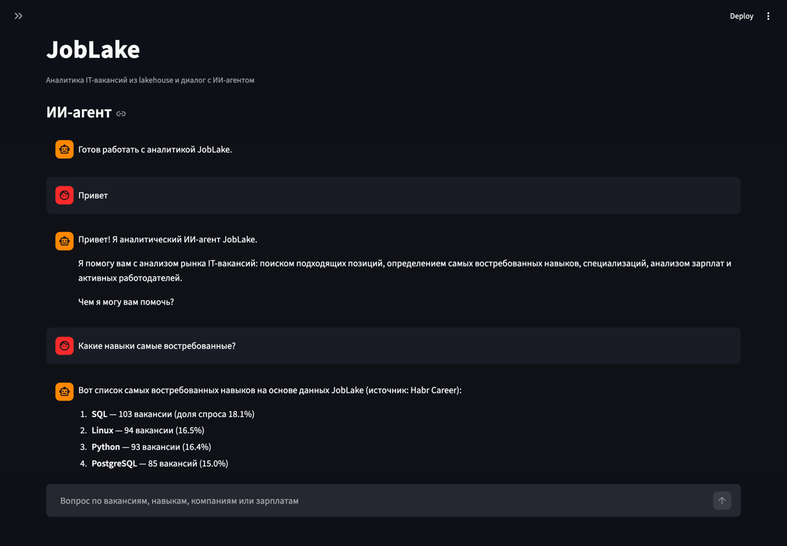

# JobLake Dashboard App

Streamlit dashboard for exploring JobLake Gold tables and chatting with the AI agent.

## Table of Contents

- [Responsibilities](#responsibilities)
- [Screenshots](#screenshots)
- [Runtime Flow](#runtime-flow)
- [Development Checks](#development-checks)

Back to the [project README](../../README.md).

## Responsibilities

The app provides:

- market overview metrics for vacancies, companies, remote share, and salary coverage;
- daily vacancy dynamics and salary median charts;
- top skills, specializations, locations, and companies;
- salary distribution by bucket;
- recent vacancies table with links back to source postings;
- chat UI that sends questions to the JobLake AI agent.

The app reads analytics from Trino and does not write to the lakehouse. Data refresh is
controlled by Streamlit cache settings and the sidebar refresh button.

## Screenshots









## Runtime Flow

1. `src.main` configures Streamlit page layout and logging.
2. The sidebar lets users switch between the dashboard and AI-agent chat.
3. Dashboard queries are executed through `TrinoClient` against Gold tables.
4. Results are cached with `st.cache_data`.
5. The chat view sends messages and recent chat history to the agent API.


## Development Checks

Run formatting from `src/app`:

```bash
uv run ruff format .
```

Run the linter from `src/app`:

```bash
uv run ruff check .
```
